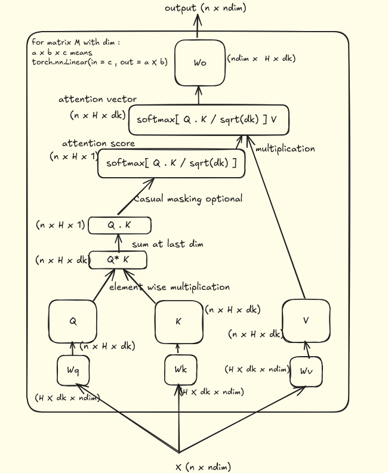
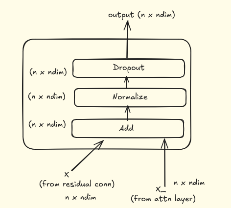
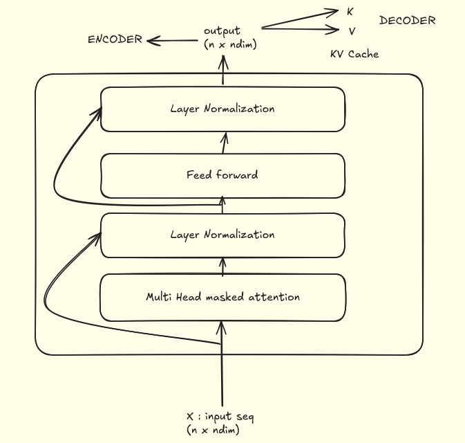
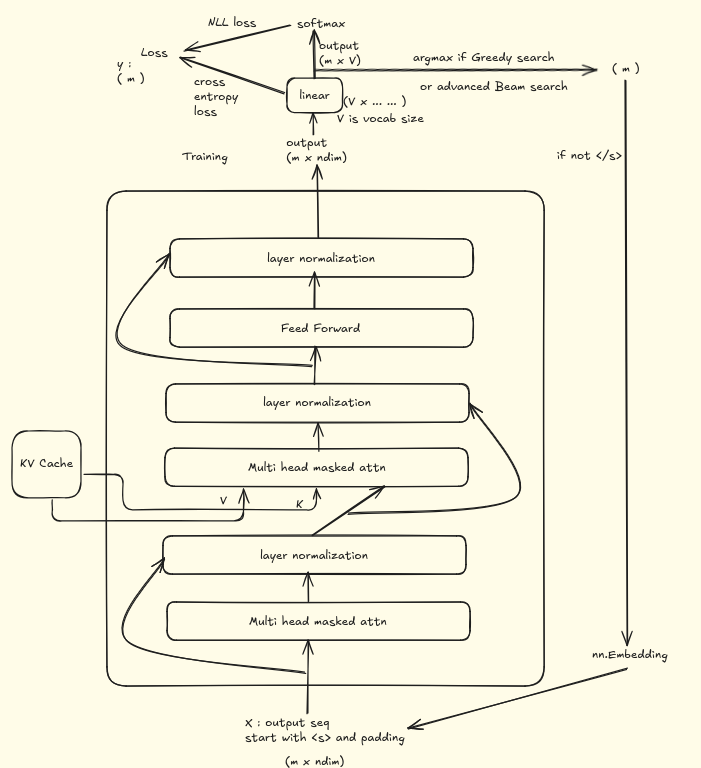

# Transformer Scratch Implementation
###  Modules : 
- #### Masked Multihead Attension

- #### Add & Normalization 

- #### Encoder 

- #### Decoder

References and Learning Material :
[Attention is all you need (pdf)](./src/attension.pdf)
[Transformer Explained](https://jalammar.github.io/illustrated-transformer)
[Beam Search](https://towardsdatascience.com/foundations-of-nlp-explained-visually-beam-search-how-it-works-1586b9849a24)
[Efficient NLP YT](https://www.youtube.com/@EfficientNLP)
[HF NLP](https://huggingface.co/learn/nlp-course/chapter1/1)